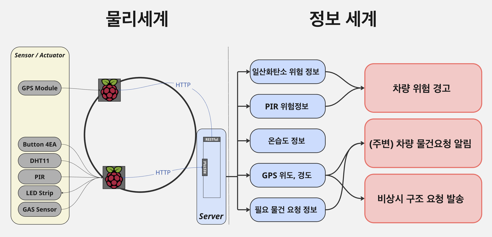

# Car-Camping-Assist-Platform

라즈베리파이와 GPS모듈, 가스센서등을 사용하여 차박(Car Camping)에 필요한 서비스를 제공하는 IoT Platform 입니다.

---

## Used Hardware

| 구성품                 | 수량 |
|----------------------|------|
| Raspberry Pi 3       | 4EA  |
| Raspberry Pi Monitor | 2EA  |
| 5V LED Strip         | 2EA  |
| GAS Sensor MQ-2      | 2EA  |
| Buzzer               | 2EA  |
| GPS Module NEO-6M    | 2EA  |
| PIR Sensor HC-SR501  | 2EA  |

---

## System Architecture

> 위 그림은 센서, 라즈베리파이, Mobius 서버 간의 통신 흐름 및 역할을 나타냅니다.

---

## Demonstration Video

  
[▶️ 전체 영상 보기](docs/demo_full.mp4)

---

## Key Features

### 1. 실시간 가스 감지  
- MQ-2 센서를 통해 캠핑카 내부의 가스 농도를 실시간으로 감지  
- 일정 수치를 초과하면 LED 점멸 및 부저 경고 발생  
- 동시에 Mobius 서버에 위험 상태 전송

### 2. GPS 기반 위치 전송  
- NEO-6M GPS 모듈을 통해 위치 정보를 주기적으로 수집  
- Mobius에 전송하여 외부에서 차량 위치 파악 가능

### 3. 움직임 감지 시스템  
- PIR 센서를 통해 야간 외부 침입 감지  
- 움직임 발생 시 부저 울림 + 서버 알림

### 4. 실시간 모니터링  
- 모니터를 통해 센서 상태 및 위험 경고를 실시간으로 확인 가능

---

## Technology Stack

- Python 3
- Raspberry Pi OS
- Mobius oneM2M IoT Platform
- REST API (HTTP + JSON)

---

## Closing

본 프로젝트는 **실제 차박 환경을 고려한 IoT 통합 플랫폼** 구축에 중점을 두었습니다.  
향후에는 앱 연동, 원격 제어, 전력 관리 시스템, AI 기반 분석 기능 등을 추가할 계획입니다.

> 캠핑의 즐거움에 안전을 더하다.  
> **Car-Camping-Assist-Platform**

---
