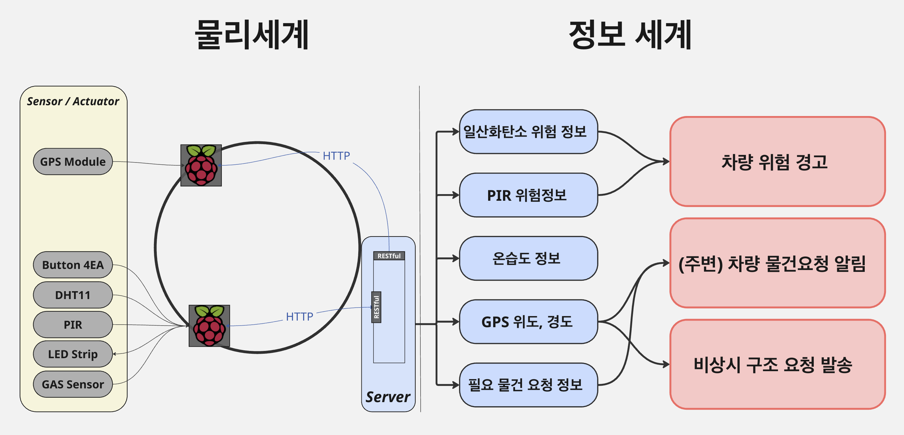

# Car-Camping-Assist-Platform

This is an IoT platform that provides essential services for car camping using Raspberry Pi, GPS modules, and gas sensors.

As someone who enjoys car camping as a hobby, I have experienced various situations in different environments.  
Through those experiences, I encountered several inconveniences and risks, which led me to plan and develop this project to solve them directly.

## 1. Sensing for Safety Assurance
During winter car camping, idle-free heaters or other heating devices are often used to maintain body temperature.  
However, due to the enclosed nature of vehicles, gas leakage can lead to serious risks such as suffocation or poisoning.  
To prevent this, an MQ-2 gas sensor is installed inside the vehicle, and the measured data is transmitted to the Mobius IoT Platform via a REST API.  
When a dangerous situation is detected, alerts are sent to nearby vehicles, allowing for an immediate response.

## 2. Item Requesting in Isolated Environments
Car camping usually takes place in remote or uninhabited areas. Especially at night or when the user is under the influence of alcohol, accessing necessary supplies becomes very difficult.  
To solve this, a NEO-6M GPS module is used to accurately determine the user's location and share it with the server along with the locations of nearby vehicles.  
This function enables users to safely request items or seek help from nearby vehicles.

---

## Used Hardware

| Component              | Quantity |
|------------------------|----------|
| Raspberry Pi 3         | 4 EA     |
| Raspberry Pi Monitor   | 2 EA     |
| 5V LED Strip           | 2 EA     |
| GAS Sensor MQ-2        | 2 EA     |
| Buzzer                 | 2 EA     |
| GPS Module NEO-6M      | 2 EA     |
| PIR Sensor HC-SR501    | 2 EA     |

---

## System Architecture

> The diagram above shows the communication flow and roles between sensors, Raspberry Pi, and the Mobius server.

---

## Demonstration Video

  
[▶ Watch Video](images/Demo_Video.mp4)

---

## Key Features

### 1. Safety Detection and Alert System  
Gas sensors, PIR sensors, and temperature/humidity sensors installed inside the vehicle detect risk factors in real-time.  
If the carbon monoxide level exceeds a certain threshold or if continuous motion is detected nearby, alerts are immediately triggered via LED and buzzer.  
This information is also sent to the Mobius server to be shared with nearby vehicles.

### 2. GPS-Based Location Transmission and Sharing  
The NEO-6M GPS module is used to track the vehicle’s current location in real-time and transmit it to the Mobius server.  
The server also receives the locations of other vehicles, enabling users to share location-based information.  
This facilitates better situational awareness and collaboration among nearby campers.

### 3. Item Request Function  
With dedicated buttons inside the vehicle, users can easily request predefined items.  
The request data is sent to Mobius, allowing nearby users to check the requested items and their location in real-time.  
This allows for quick and efficient supply requests even in remote or nighttime situations.

---

## Technology Stack

- Python 3  
- Raspberry Pi OS  
- Mobius oneM2M IoT Platform  
- REST API (HTTP + JSON)

---

## Closing

This project focused on building a practical **IoT platform tailored to real-world car camping environments**.  
Developed by Choi.J, Kim.J, Seo.J, Chae.K – SCH University.

> Enhancing the joy of camping with safety.  
> **Car-Camping-Assist-Platform**

---
